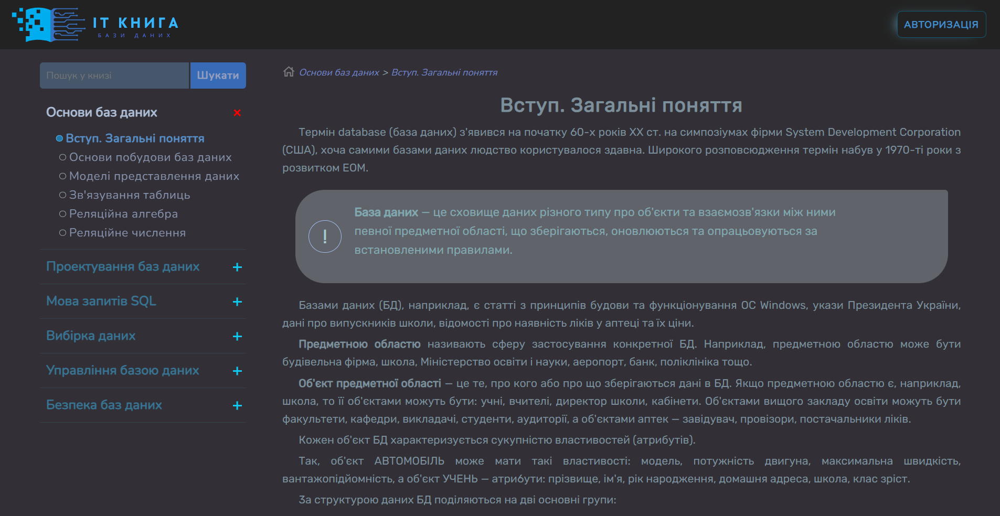

<!-- PROJECT SHIELDS -->
[![Contributors][contributors-shield]][contributors-url]
[![Forks][forks-shield]][forks-url]
[![Stargazers][stars-shield]][stars-url]
[![Issues][issues-shield]][issues-url]

<!-- PROJECT LOGO -->
<br />
<div align="center">
  <a href="https://github.com/LashkayDaniel/itbook">
    
  </a>
</div>

<!-- ABOUT THE PROJECT -->

## About The Project


The project "IT Book. Database" is an online resource that provides access to collected and structured information about
various aspects of databases. Its goal is to provide users with access to useful and up-to-date information about
concepts, methods, tools, and technologies related to databases.

Here's why:

* **Search Functionality:** The search feature allows users to quickly find specific information they are looking for
  within
  the vast database of materials. This enhances user experience and efficiency in accessing relevant content.
* **Authentication and Registration:**  Registered users have access to material storage.
* **Convenient Admin Panel:** The convenient admin panel streamlines the management of the platform for administrators.
  It
  provides tools for content management, user management, and other administrative tasks, making it easier to
  maintain and update the platform.

### Built With

The application was developed using these tools:

* [![Vue][Vue.js]][Vue-url]
* [![Laravel][Laravel.com]][Laravel-url]
* [![MySql][MySql.com]][MySql-url]

<!-- GETTING STARTED -->

## Getting Started

A brief step-by-step description of how to install all dependencies for the application to work correctly

### Requirements

Before getting started, make sure your environment meets the following requirements:

- PHP >= 8.0
- Composer
- Node.js >= 21.x
- NPM >= 9.x
- MySQL

### Installation

1. Clone the repository to your local machine:
    ```bash
    git clone https://github.com/LashkayDaniel/itbook.git
    ```

2. Navigate to the project directory:
    ```bash
    cd itbook-labs
    ```

3. Install PHP dependencies using Composer:
    ```bash
    composer install
    ```

4. Install JavaScript dependencies using NPM:
    ```bash
    npm install
    ```

5. Create the `.env` configuration file and generate the application key:
    ```bash
    cp .env.example .env
    php artisan key:generate
    ```

6. Configure the database connection in the `.env` file.

7. Run the migrations to create the necessary tables in the database:
    ```bash
    php artisan migrate
    ```

8. Start the local server using Artisan:
    ```bash
    php artisan serve
    ```

9. In another terminal window, start the Vue development server using NPM:
    ```bash
    npm run dev
    ```

10. Open your browser and go to `http://localhost:8000`.

<!-- MARKDOWN LINKS & IMAGES -->

[contributors-shield]: https://img.shields.io/github/contributors/LashkayDaniel/itbook.svg?style=for-the-badge

[contributors-url]: https://github.com/LashkayDaniel/itbook-labs/graphs/contributors

[forks-shield]: https://img.shields.io/github/forks/LashkayDaniel/itbook?style=for-the-badge

[forks-url]: https://github.com/LashkayDaniel/itbook-labs/network/members

[stars-shield]: https://img.shields.io/github/stars/LashkayDaniel/itbook.svg?style=for-the-badge

[stars-url]: https://github.com/LashkayDaniel/itbook/stargazers

[issues-shield]: https://img.shields.io/github/issues/LashkayDaniel/itbook.svg?style=for-the-badge

[issues-url]: https://github.com/LashkayDaniel/itbook/issues

[Vue.js]: https://img.shields.io/badge/Vue.js-35495E?style=for-the-badge&logo=vuedotjs&logoColor=4FC08D

[Vue-url]: https://vuejs.org/

[Laravel.com]: https://img.shields.io/badge/Laravel-FF2D20?style=for-the-badge&logo=laravel&logoColor=white

[Laravel-url]: https://laravel.com

[MySql.com]: https://img.shields.io/badge/MySQL-4479A1?style=for-the-badge&logo=mysql&logoColor=white

[MySql-url]: https://www.mysql.com/
